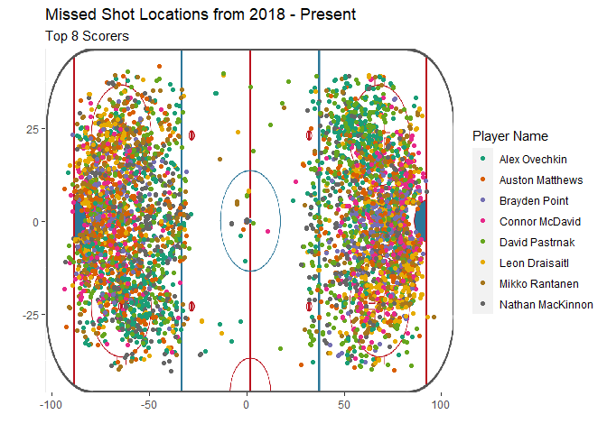
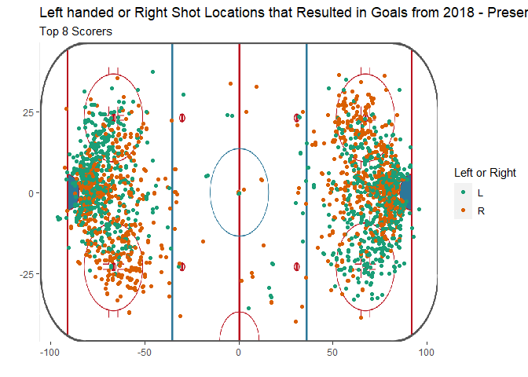

Shots by Top 8 Players
================
Kit Applegate
2023-07-03

``` r
library(tidyverse)
library(ggpubr)
library(data.table)
library(RColorBrewer)
rink <- png::readPNG("rinkDiagram.png")

shots <- fread("Data/shots.csv")

skaters <- fread("Data/skatersAll.csv")
```

``` r
shots.filter <- shots %>%
  filter(season > 2017) %>%
  select( "game_id", "season", "team", "location", "event",
                  "isPlayoffGame", "xCord", "yCord", "shotDistance",
                  "shotAngle", "shooterPlayerId",
                  "shooterName", "shooterLeftRight", "shooterTimeOnIce") 

skaters.Filter <- skaters %>%
  filter(season > 2017) %>%
  select(name, team, position) %>%
  rename(shooterName = "name", SkaterTeam = "team")


shots.Player.Join <- inner_join(shots.filter, skaters.Filter, by = "shooterName")
  
shots.Player.Join <- distinct(shots.Player.Join)


top_players <- shots.Player.Join %>%
  group_by(shooterName, SkaterTeam, position) %>%
  summarise(Goals = sum(event == "GOAL"), 
            Misses = sum(event == "MISS"), 
            Shots = sum(event == "SHOT"), 
            Ice.AVG = round(mean(shooterTimeOnIce), 0), 
            Shot.Dist.AVG = round(mean(shotDistance), 0),
            goal.Percentage = round((Goals / Shots) * 100, 2), 
            Blocked = Shots - (Goals + Misses),
            Successful = Goals + Blocked, 
            Accuracy = (Successful / Shots) * 100 ) %>%
  arrange(desc(Goals)) %>%
  head(8)
 

top_player_list <- as.list(top_players$shooterName)

top_players
```

    ## # A tibble: 8 × 12
    ## # Groups:   shooterName, SkaterTeam [8]
    ##   shooterName      SkaterTeam position Goals Misses Shots Ice.AVG Shot.Dist.AVG
    ##   <chr>            <chr>      <chr>    <int>  <int> <int>   <dbl>         <dbl>
    ## 1 Leon Draisaitl   EDM        C          256    471  1012      50            26
    ## 2 Auston Matthews  TOR        C          242    639  1369      40            27
    ## 3 Connor McDavid   EDM        C          239    409  1213      46            22
    ## 4 David Pastrnak   BOS        R          234    624  1419      38            33
    ## 5 Alex Ovechkin    WSH        L          225    675  1320      47            35
    ## 6 Nathan MacKinnon COL        C          211    542  1661      44            32
    ## 7 Mikko Rantanen   COL        R          201    481  1038      42            29
    ## 8 Brayden Point    T.B        C          200    382   835      41            22
    ## # ℹ 4 more variables: goal.Percentage <dbl>, Blocked <int>, Successful <int>,
    ## #   Accuracy <dbl>

``` r
shots.filter %>%
  filter(shooterName %in% top_player_list, 
         event == "GOAL") %>%
  ggplot(aes(color = shooterName)) +
  background_image(rink) +
  geom_jitter(aes(x = xCord,y = yCord)) +
  scale_color_brewer(palette = "Dark2") + 
  labs(title = "Shot Locations the Resulted in Goals from 2018 - Present", 
       subtitle = "Top 8 Scorers",
       x = "",
       y = "", 
       color = "Player Name") +
  ylim(-42,42) 
```

<!-- -->

``` r
shots.filter %>%
  filter(shooterName %in% top_player_list, 
         event == "MISS") %>%
  ggplot(aes(color = shooterName)) +
  background_image(rink) +
  geom_jitter(aes(x = xCord,y = yCord)) +
  scale_color_brewer(palette = "Dark2") + 
  labs(title = "Missed Shot Locations from 2018 - Present", 
       subtitle = "Top 8 Scorers", 
       x = "", 
       y = "", 
       color = "Player Name") +
  ylim(-42,42)
```

<!-- -->

``` r
shots.filter %>%
  filter(event == "GOAL", 
         shooterName %in% top_player_list) %>%
  ggplot(aes(color = shooterLeftRight)) +
  background_image(rink) +
  geom_jitter(aes(x = xCord,y = yCord)) +
  scale_color_brewer(palette = "Dark2") + 
  labs(title = "Left handed or Right Shot Locations that Resulted in Goals from 2018 - Present", 
       subtitle = "Top 8 Scorers", 
       x = "", 
       y = "", 
       color = "Left or Right") +
  ylim(-42,42) 
```

<!-- -->
# Hockey
